# Claude Code 安全使用指南

由于 Anthropic 的政策，claude 模型不对中国大陆提供，否则给予封号处罚，这导致很多中国用户无法享受 claude opus 模型带来的先进生产力，毕竟花了高昂的订阅费用最后账号被封，不是每个人都能接收的，因此本文将会提供一种安全的方法来让用户放心大胆的享受 claude 模型。

**与别的教程不同的是，本文会手把手教学教你配置每一步，本文推荐的第三方服务也都相较安全，预估在完成配置后除去购买 claude 套餐的费用，你每月需要支付大概 50 元人民币，而且这个配置过程不仅适用于 claude code，还适用于任何你需要安全访问跨境服务的场景。**

## 核心流程

根据本文的流程配置完毕后，你使用 claude code 的流程将会如下所示：

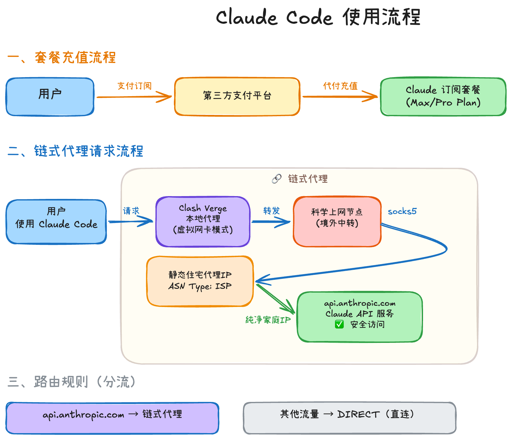

另外阅读本文教程请注意以下几点：

1. **本文演示基于macos，但 windows 上的配置基本相同**
2. **你的设备当前需要支持科学上网**
3. **中间的某一步如果在你本地跑不通，可尝试让AI解答**
4. **该方法适用于任何你需要安全访问跨境服务的场3景**

### 一、购买静态住宅代理IP

Anthropic 封禁账号的一大原因是网络使用环境，包括如下：

- **VPN 使用**：使用 VPN 登录可能触发风控系统，尤其是 VPN 的 IP 地址曾被滥用或与可疑活动关联
- **IP 地址异常**：IP 检测越来越严格，地理位置不一致或频繁变动会被标记
- **非常规网络**：使用被标记为高风险的 IP 段

所以访问 claude 服务一定要准备一个**纯净安全**的家庭 IP，大部分人被封号主要是因为使用机场 IP 访问，这些 IP 大多都属于高危风控 IP。

市面上有很多提供静态住宅代理 IP 的服务商，小白这里乱选很容易踩坑浪费钱，我先解释下这里的具体逻辑，一般我们判断一个 IP 是否安全可以参考一下两个网站：

1. **https://ipinfo.io (更权威)**
2. **https://ping0.cc**

读者可以随便找个 IP 在这些网站上试下，对于 ipinfo 会看到如下信息：

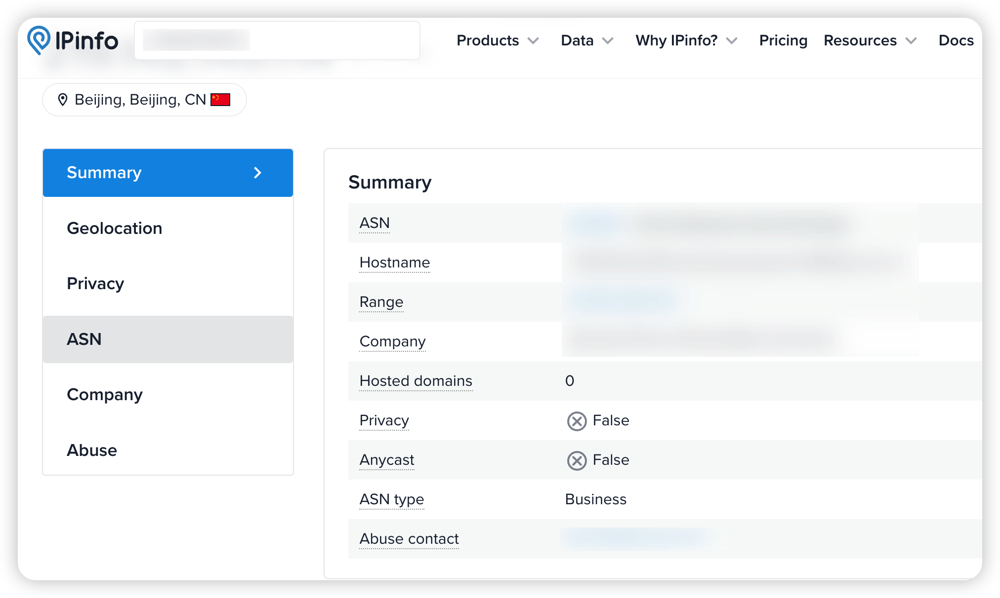

这里核心要关注的是 ASN type 和 Privacy，如果ASN Type 值为 ISP 即代表为家庭 IP，至于 Privacy 要确保其值为 False，即下列检测值全部为False，否则表明该 IP 可能是伪装成 ISP。

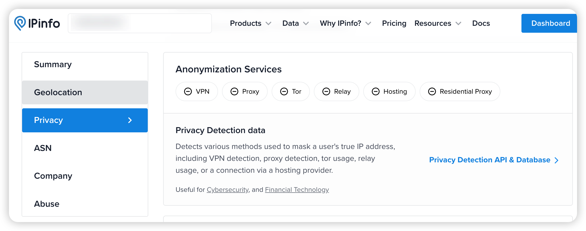

对于 ping0 会看到信息如下，我们需要关注 IP 类型和风控值，确保**前者显示家庭带宽 IP，后者值较低。**

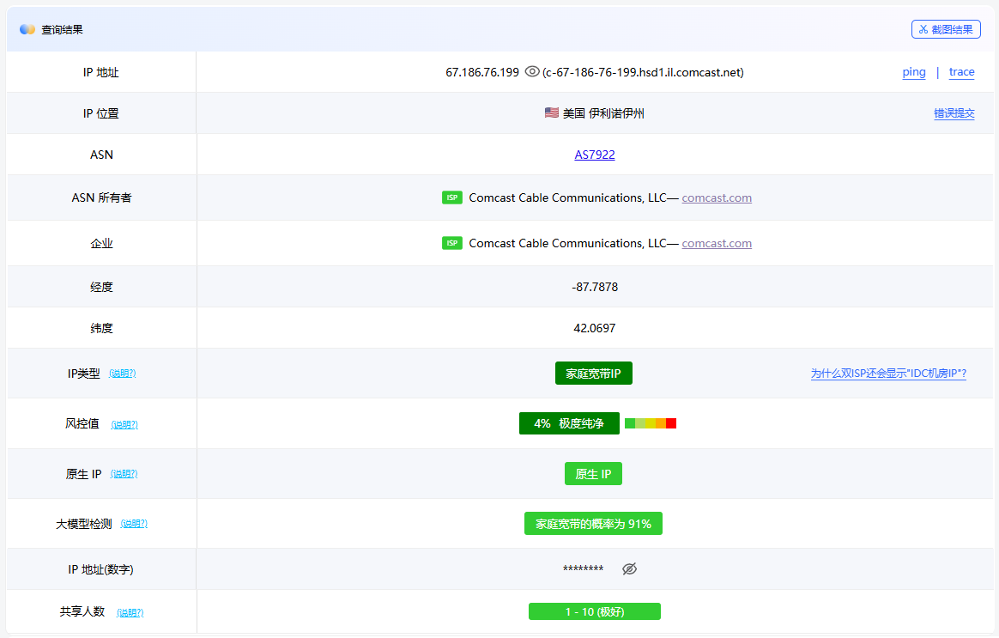

由于 ipinfo 比较权威，部分服务商选取 IP 的逻辑是基于 ipinfo 的 ASN type 字段，通过过滤选取值为 ISP 的 IP，然后对外宣称是纯净静态住宅代理 IP，正如前面所说，这部分 IP 可能是伪装的 ISP，即在 ipinfo 里 Privacy 的值为 True，甚至在 ping0 可以检测出是 机房 IP。

根据我的踩坑经验，我这里推荐的服务商为 [iproval](https://dashboard.iproyal.com/me)，原因如下：

1. **价格便宜**：一个月 4 美元
2. **提供 http/https/socks5 代理协议**：使用 socks5 更加安全
3. **24h内支持更换**：iproval 提供的 ISP 也有可能是伪装的，但 iproval 支持 24h 内更换IP
4. **支持支付宝支付**

首先点击链接[iproval](https://dashboard.iproyal.com/me)打开网站，注册完毕后在侧边栏选择静态住宅代理

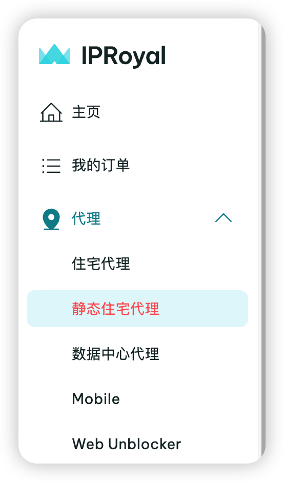

在支付页面选择代理地区为美国，然后提交订单

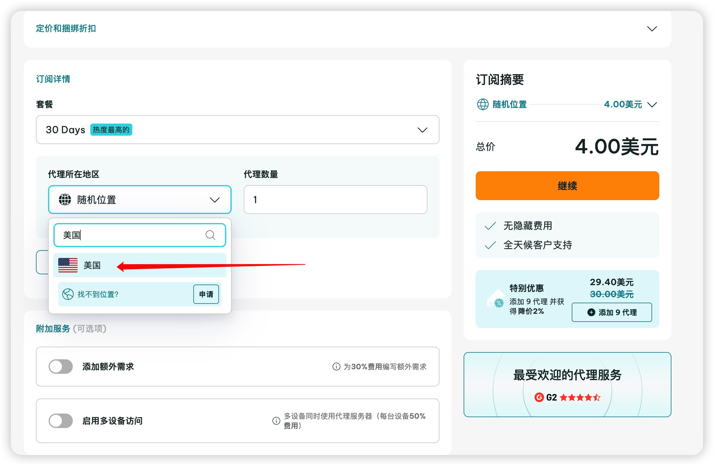

此时静态住宅代理页面会显示你刚支付的订单

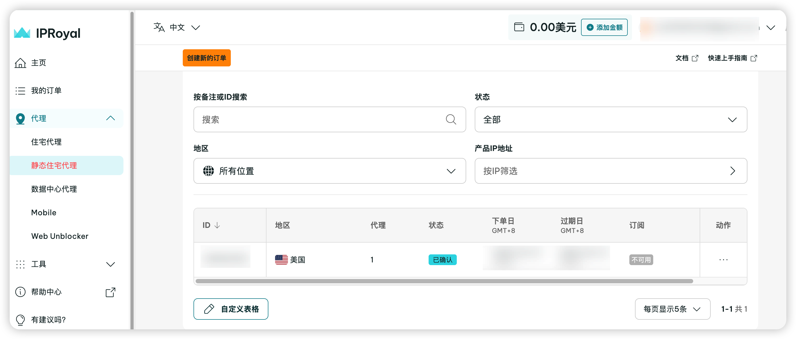

点击订单可以看到购买的 IP 信息，将协议切换至 **socks5**，记录如下信息：

- **IP 地址**
- **端口号**
- **用户名**
- **密码**

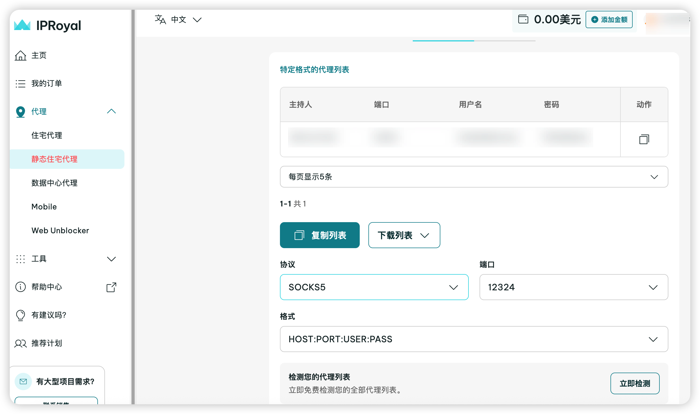

可以在页面下方点击**立即检测**来测试代理 IP 能否正常工作。

**重点来了，拿到 IP 后立即去 ipinfo 和 ping0 检测 IP 信息**，需要满足：

- ipinfo 的检测结果里，ASN type 为 ISP，且 Privacy 为False
- ping0 的检测结果里，IP 类型为 家庭 IP 且风控值较低
  
如果不满足上述条件，**请立刻联系客服更换**，理由是 IP 不安全。

最后可以利用下列 shell 命令，将大括号里的值更换为你的 IP 信息，在本地执行，理论上是可以看到命令打印的 IP 地址就是你刚购买的 IP，如果命令执行失败也没关系，毕竟国内也无法直连访问这些 IP。

```shell
curl --proxy socks5h://{username}:{passwd}@{ip}:{port} https://ipinfo.io
```

### 二、购买代理服务

大部分情况下，国内是无法直连访问你购买的 IP 的，正如你无法访问 Google 等服务一样，所以我们需要**链式代理**来帮助我们访问该 IP，而构建链式代理的基础是**需要科学上网服务**。

这一步应该很多人可以跳过，毕竟科学上网嘛，谁还不会呢？

如果你还没有购买的话我推荐你试下[狗狗代理](https://invite.dginv.click/#/register?code=MgoDAp9J)，新人连续两天送 1G 流量，有效期2天，可以先体验下不用花钱，下面的流程我也使用狗狗代理来演示。

### 三、配置链式代理

首先安装 clash verge，点击[clash verge](https://www.clashverge.dev/install.html)跳转到页面下载安装，完成后打开该软件，然后在狗狗代理的这个页面点击导入到 clash 来一键导入配置，这个功能代理服务商一般都会有，读者可用自己购买的代理服务商的一键导入来导入配置

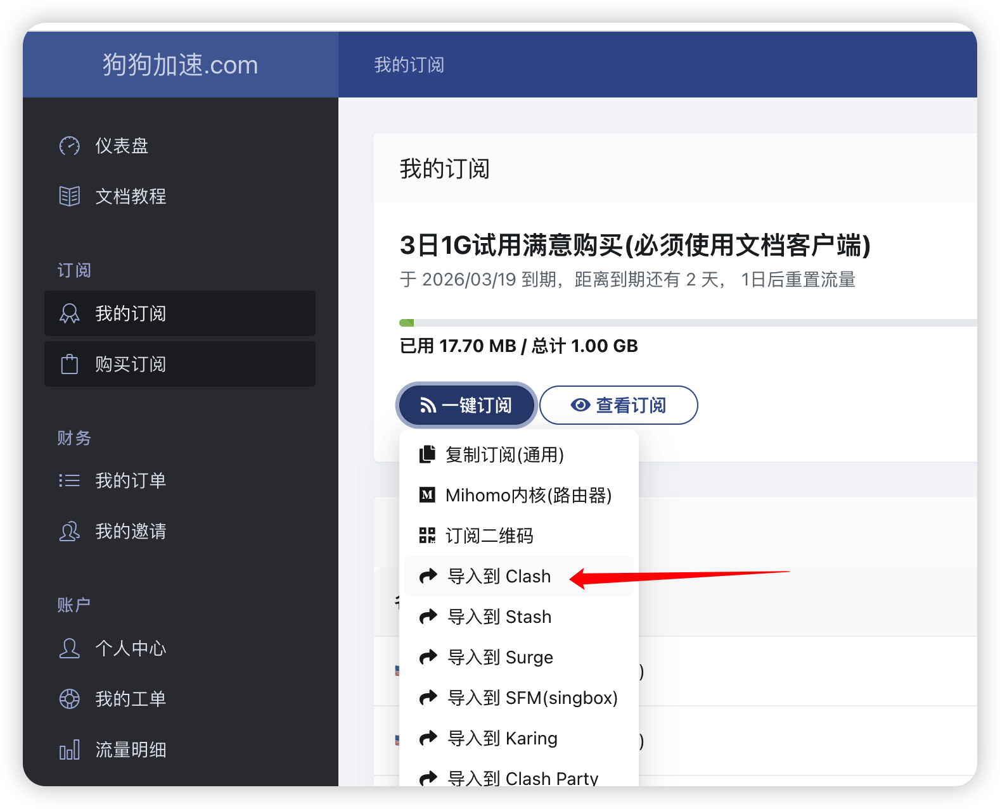

导入完成后，在 clash verge 的订阅页面选择刚刚导入的配置，在代理页面点击测试下各节点的网速。

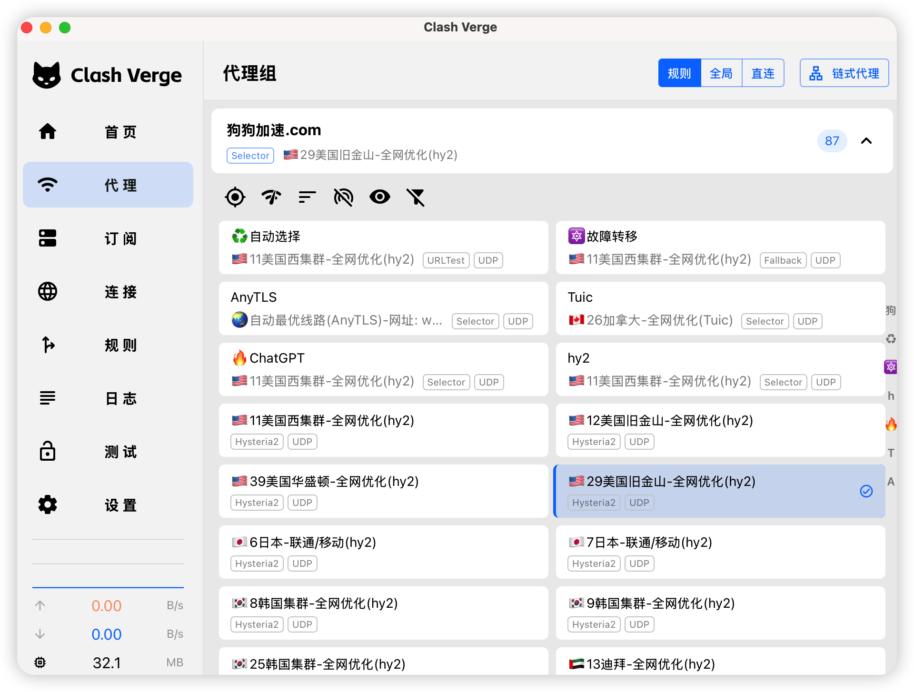

在订阅页面，右键代理打开配置文件

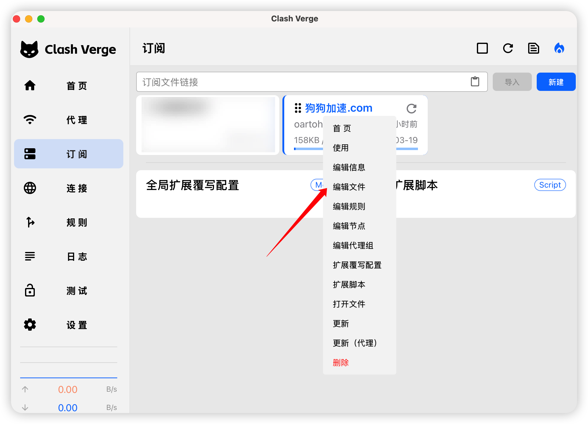

在`proxies`这里选择一个节点，要求是**地理位置距离你购买的静态住宅代理IP近且网络测试时延低**

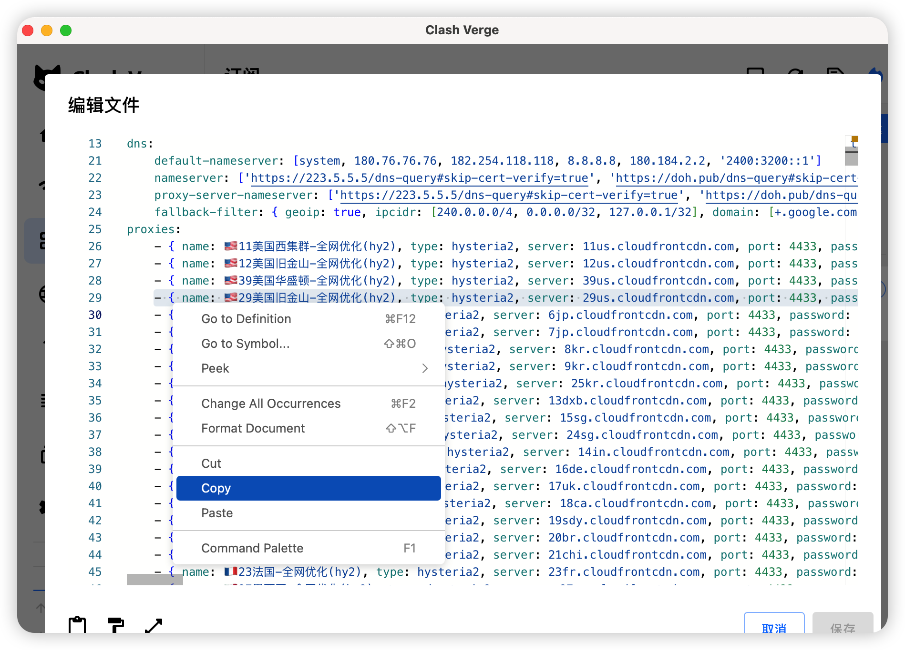

然后新建一个文件 `config.yaml`，内容如下：

```yaml
mixed-port: 7897
allow-lan: false
mode: global

proxies:
  - {你刚选择的节点}
  - name: 静态IP代理
    type: socks5
    server: 你购买的IP # 替换，例如 127.0.0.1
    port: 你购买的IP的PORT # 替换，例如 2370
    username: "用户名" # 替换，例如 "dwddcdeew"
    password: "密码" # 替换，例如 "mcdeyncdw"
    udp: false
    dialer-proxy: 你刚选择的节点的name字段 # 替换

proxy-groups:
  - name: AI服务
    type: select
    proxies:
      - 静态IP代理

rules:
  - MATCH,AI服务                   
```

注意上述配置的`mixed-port`值需要与 clash 设置里的一致

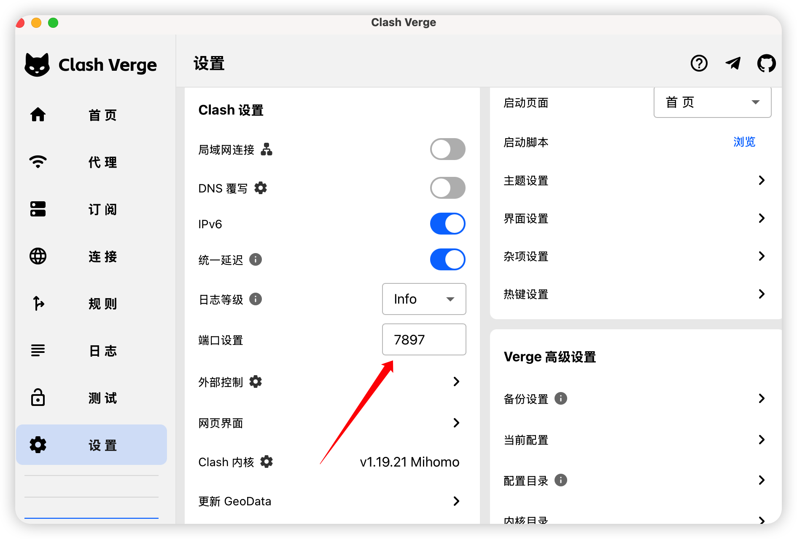

在订阅页面点击新建，类型选择 Local，导入`config.yaml`，填写名称后保存

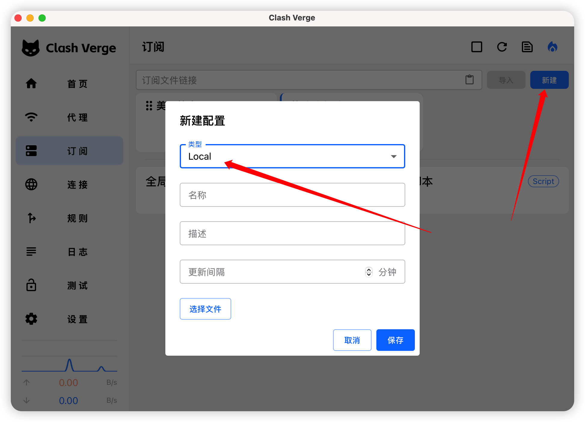

此时订阅里会多一个卡片即刚刚创建的代理组，点击该卡片，在代理页面测试下时延，理论上不该出现 timeout

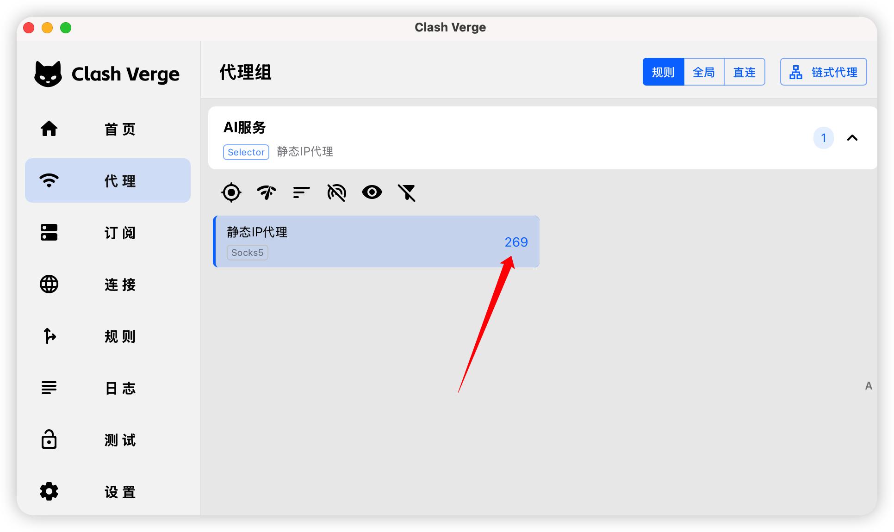

最后在设置里启用虚拟网卡模式，这样本地所有流量都会走该代理

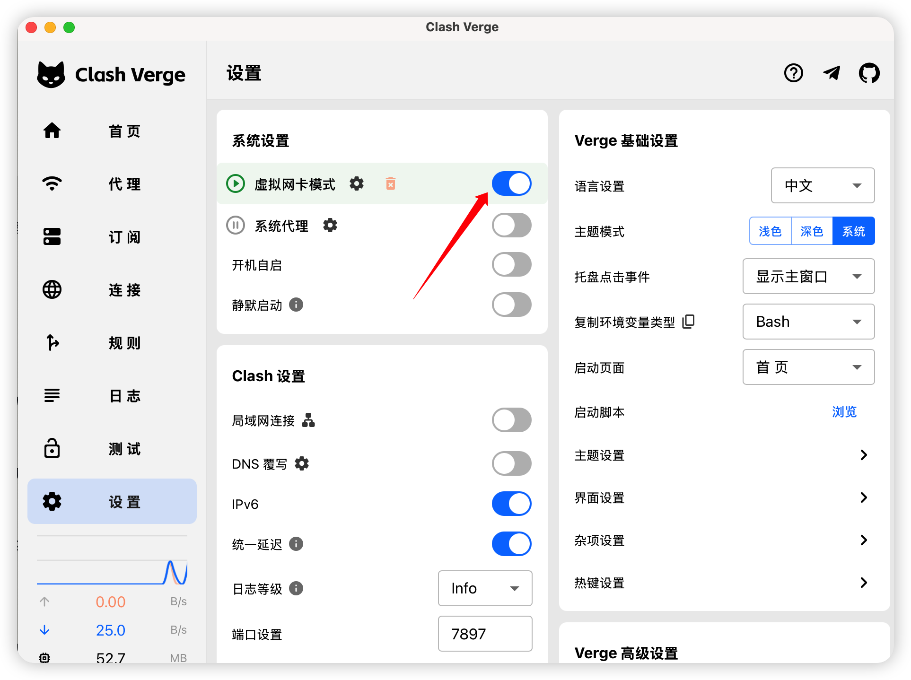

打开终端执行`curl ipinfo.io` 命令，预期打印的 IP 地址即你购买的 IP。

### 四、配置路由规则

上面的配置实现的效果是本地所有流量全部走链式代理，对于 Claude Code 的使用，我们可以只配置与 Claude 相关的请求走代理，这样可以节省代理流量。

Anthropic 提供的`base_url`是https://api.anthropic.com，我们可以选择只让这个路径下的请求走链式代理，只需更改`config.yaml`如下：

```yaml
mixed-port: 7897
allow-lan: false
mode: rule # 更改

proxies:
  - {你刚选择的节点}
  - name: 静态IP代理
    type: socks5
    server: 你购买的IP 
    port: 你购买的IP的PORT 
    username: "用户名" 
    password: "密码" 
    udp: false
    dialer-proxy: 你刚选择的节点的name字段 

proxy-groups:
  - name: AI服务
    type: select
    proxies:
      - 静态IP代理

rules:
  - DOMAIN-KEYWORD,anthropic,AI服务 # 新增
  - DOMAIN-KEYWORD,claude,AI服务 # 新增
  - MATCH,DIRECT
```

> 💡rules里也可以使用`DOMAIN-SUFFIX`精准捕获url，这里用`DOMAIN-KEYWORD`更粗暴更省事。

clash 开启虚拟网卡模式后，本地打开终端执行`curl ipinfo.io` 命令，此时返回的应该是你的本机 IP，然后再执行`curl https://api.anthropic.com/v1/messages`，不用管结果，回到clash 的日志界面，搜索日志看到该请求使用了链式代理，即代表配置成功生效。

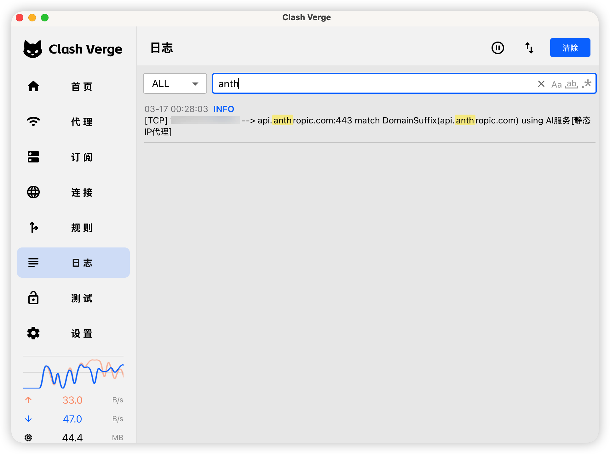

注意因为开启的是虚拟网卡模式，所有流量都会经过 clash，所以这种方法使用 claude desktop app 也是完全没问题的。

同理，如果你有别的网址需要走纯净 IP 来访问，只需要在 rules 里更改或添加即可

### 五、Clash 配置最佳实践

根据我的经验，我将使用场景主要分为两类，一类是**个人使用场景**，一类是**办公使用场景**。

对于**个人使用场景**，我们期望请求 claude 模型的流量走家庭纯净代理，而对于 github、google 等同样需要代理才能访问的场景，我们可以在 rules 里用同样的方法让这些请求走纯净代理或者直接走机场 IP，这种配置方法比较简单，读者照猫画虎改文件即可，比如下面的示例：

```yaml
mixed-port: 7897
allow-lan: false
mode: rule

proxies:
  - {你刚选择的节点}
  - name: 静态IP代理
    type: socks5
    server: 你购买的IP 
    port: 你购买的IP的PORT 
    username: "用户名" 
    password: "密码" 
    udp: false
    dialer-proxy: 你刚选择的节点的name字段 

proxy-groups:
  - name: AI服务
    type: select
    proxies:
      - 静态IP代理

rules:
  - DOMAIN-KEYWORD,anthropic,AI服务
  - DOMAIN-KEYWORD,claude,AI服务
  - DOMAIN-KEYWORD,google,AI服务 # 这里也可以不填AI 服务，填你购买的机场，毕竟访问这些网站不需要纯净IP
  - DOMAIN-KEYWORD,github,AI服务
  - MATCH,DIRECT
```

对于**办公使用场景**，如果读者用第四节的配置会发现一个问题，办公网可以访问一些网站但开了 clash 后无法访问，而且这些网站是没有命中我们设置的代理规则的，比如有些人的办公网可以直连 Google，但按上述配置 clash 后发现无法访问 Google，这里问题的本质 Clash Tun 模式接管了 DNS 解析，导致部分网站域名解析错误。解决这个问题也很简单，可以手动设置下 DNS 地址，macos 用户可以执行下列指令查看办公网有哪些 DNS 地址。

```shell
scutil --dns | grep "nameserver" | head -5
```

根据获取的 DNS 地址，对配置文件新增 DNS 配置：

```yaml
mixed-port: 7897
allow-lan: false
mode: rule 

dns: # 增加 DNS 配置
  enable: true
  enhanced-mode: redir-host
  nameserver:
    - X.X.X.X
    - X.X.X.X

proxies:
  - {你刚选择的节点}
  - name: 静态IP代理
    type: socks5
    server: 你购买的IP 
    port: 你购买的IP的PORT 
    username: "用户名" 
    password: "密码" 
    udp: false
    dialer-proxy: 你刚选择的节点的name字段 

proxy-groups:
  - name: AI服务
    type: select
    proxies:
      - 静态IP代理

rules:
  - DOMAIN-KEYWORD,anthropic,AI服务
  - DOMAIN-KEYWORD,claude,AI服务
  - MATCH,DIRECT
```

通过上述配置即可实现办公网只有 Claude 请求走代理，其余请求保持原状。

读者可将上述两份配置分别导入 Clash，在需要时灵活切换。

### 六、注册账号

### 七、购买 Claude Code 套餐

这里如果你愿意钻研的话可以研究如何安全支付购买，我给出的方法是用第三方服务，他们可以保证支付这条链路是安全的，不过是要收取一定的手续费，这里我使用[wild](https://bewild.ai?code=1L8VLDN9)，具体的充值方式可以参考该网站。

如果有同学愿意分享也可以提 PR 补充下如何个人购买从而节省手续费。

### 八、使用 Claude Code

如果你之前是通过 api key 的方式使用 Claude Code，只需要进入 Claude Code，用`/login`指令登录你的 Claude 账号即可，然后注释掉环境变量里的 `ANTHROPIC_BASE_URL` 和 `ANTHROPIC_AUTH_TOKEN`，此时重新启动 Claude Code，会默认使用订阅套餐。

## 总结

本文主要是用链式代理来教你如何安全访问 claude code，记得在使用时打开 clash verge，如果你有任何不确定，例如开启 clash 后请求 Claude 有没有走代理，可以在 Clash 的日志页面验证，有任何问题欢迎提**ISSUE!**
